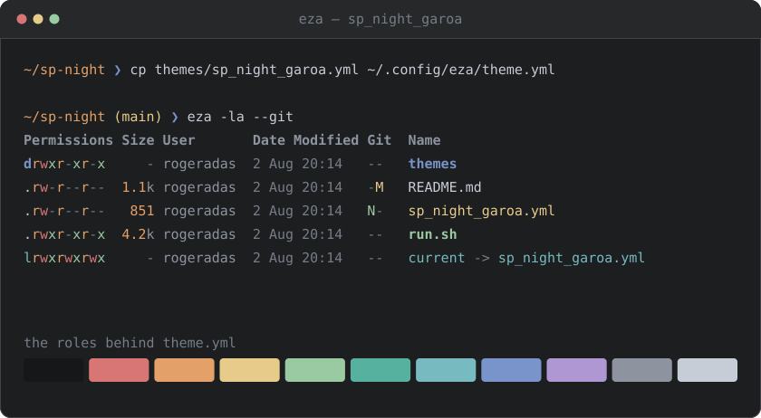
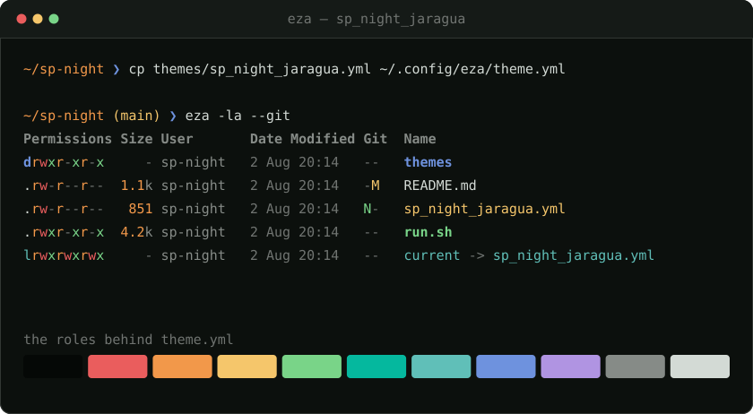

<p align="center">
  <a href="https://sp-night.github.io">
    
  </a>
</p>

<h1 align="center">SP Night for <a href="https://eza.rocks/">eza</a></h1>

<p align="center">
  <strong>The sodium lamp turns the whole city this colour.</strong><br>
  A dark colour scheme with São Paulo as its reference — the sodium street lamp,<br>
  exposed concrete, the free span of the MASP, the drizzle before the rain.
</p>

<p align="center">
  <a href="https://sp-night.github.io"><strong>sp-night.github.io</strong></a>
  &nbsp;·&nbsp;
  <a href="https://sp-night.github.io/palette">palette</a>
  &nbsp;·&nbsp;
  <a href="https://sp-night.github.io/spec">spec</a>
  &nbsp;·&nbsp;
  <a href="https://sp-night.github.io/ports">ports</a>
</p>

---

## The flavours

All three are dark, by decision. The previews below are synthetic — drawn from the
palette itself, so they can never drift from what you install.

### Noite Paulista — `sp_night_noite.yml`

The city at 3am. Blue-violet dark, the sodium lamp burning warm on top.


### Garoa — `sp_night_garoa.yml`

The same window, seen through the drizzle. Flat grey — the garoa does not cool
the city down, it washes it out.



### Pico do Jaraguá — `sp_night_jaragua.yml`

The same night, seen from the city's highest point. Near-black surfaces, with
the forest left to the accents — and the red-and-white tower lit at the summit.



## Install

These are native [eza themes](https://github.com/eza-community/eza/blob/main/docs/theme.md):
eza reads a single `theme.yml` from `~/.config/eza` (or `$EZA_CONFIG_DIR`) on
every run — no shell integration, nothing to source.

Grab the flavour you want **as** `theme.yml`:

```sh
mkdir -p ~/.config/eza
curl -Lo ~/.config/eza/theme.yml \
  https://raw.githubusercontent.com/sp-night/eza/main/themes/sp_night_noite.yml
```

That's it — the next `eza` invocation picks it up.

Prefer a checkout? Clone and symlink, and switching flavours becomes re-pointing
one link:

```sh
git clone https://github.com/sp-night/eza.git
ln -sf "$PWD/eza/themes/sp_night_noite.yml" ~/.config/eza/theme.yml
```

> [!NOTE]
> Coming from the old `sp_night_*.sh` port? Remove the `source` line from your
> shell rc — a set `EZA_COLORS` variable overrides the theme file.

## What gets themed

| `theme.yml` key | Role | Meaning |
|---|---|---|
| `filekinds.directory` | `syntax.keyword` | directories in bold *marginal* — the expressway sign pointing the way |
| `filekinds.executable` | `diagnostic.ok` | executables in bold *ibira*, green light |
| `filekinds.symlink` / `symlink_path` | `syntax.operator` / `syntax.function` | symlinks and their targets in *sereno*, the cold signage of dawn |
| `perms.*_read` / `*_write` / `*_execute` | `syntax.constant` / `diagnostic.error` / `diagnostic.ok` | read is *sódio*, write is *brasa*, execute is *ibira* |
| `size.number_*` / `size.unit_*` | `syntax.number` / `ui.fg_dim` | file sizes — the number burns, the unit recedes |
| `users.user_you` / `user_other` | `ui.fg_dim` / `ui.fg_muted` | your user quiet, everyone else quieter — root in *brasa* |
| `date` | `ui.fg_muted` | dates as ornament, never shouting |
| `git.new` `modified` `deleted` | `git.added` / `git.modified` / `git.removed` | git status in *ibira* / *táxi* / *brasa* |
| `filekinds.pipe` `socket` `*_device` | `syntax.type` / `syntax.macro` / `syntax.attribute` | pipes, sockets and devices in *temporal*, *estaiada*, *táxi* |
| `extensions.go` `.rs` `.py`, … | per-language accents | source files keep the same accents the editor port gives them |

No hex in this repo was picked by hand. Every value comes from the
[SP Night palette](https://sp-night.github.io/palette) through its role layer,
both published as data:
[`palette.json`](https://sp-night.github.io/palette.json) and
[`roles.json`](https://sp-night.github.io/roles.json). The contrast floors those
colours have to clear are [written down in the spec](https://sp-night.github.io/spec)
and enforced in CI.

## The mapping

[`eza.yml.tmpl`](eza.yml.tmpl) is the full record of which `theme.yml` key means which
role — the table above in complete form, across all ~80 keys eza exposes. The files in
[`themes/`](themes) are what it resolves to, one per flavour.

You never need it to use the theme: the shipped files are plain text and final.
It is here so the mapping survives, and so a retuned palette can be rolled
through this port without anyone re-deciding what a directory should look like.

## License

[MIT](LICENSE)
